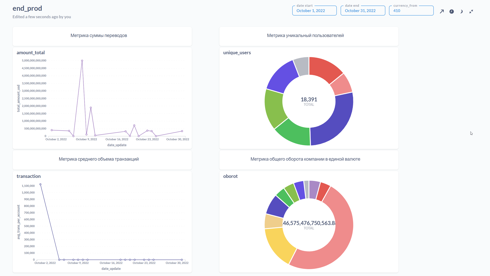

# Итоговый проект — Data Engineering

**Кратко:**

* Реализована загрузка данных из PostgreSQL в Vertica (stage).
* В Vertica создана итоговая витрина `global_metrics` с инкрементальной загрузкой по дате.
* Настроен Airflow DAG для наполнения витрины (деятельность: удаление старых данных за дату и вставка агрегатов).
* Собран автoобновляемый дашборд в Metabase, картинка дашборда лежит в `img/дэш.png`.

---

## Структура репозитория (рекомендованная)

```
repo/
├─ dags/
│  └─ dwh_loader.py       # DAG для наполнения global_metrics
│  └─ stg_loader.py       # DAG для наполнения stage
├─ sql/
│  ├─ ddl_dwh.sql         # SQL создания таблицы в Vertica
│  └─ ddl_staging.sql     # SQL-создания таблиц в stage
├─ img/
│  └─ дэш.png                           # картинка дашборда
├─ README.md                            
```

---

## Metabase — дашборда

